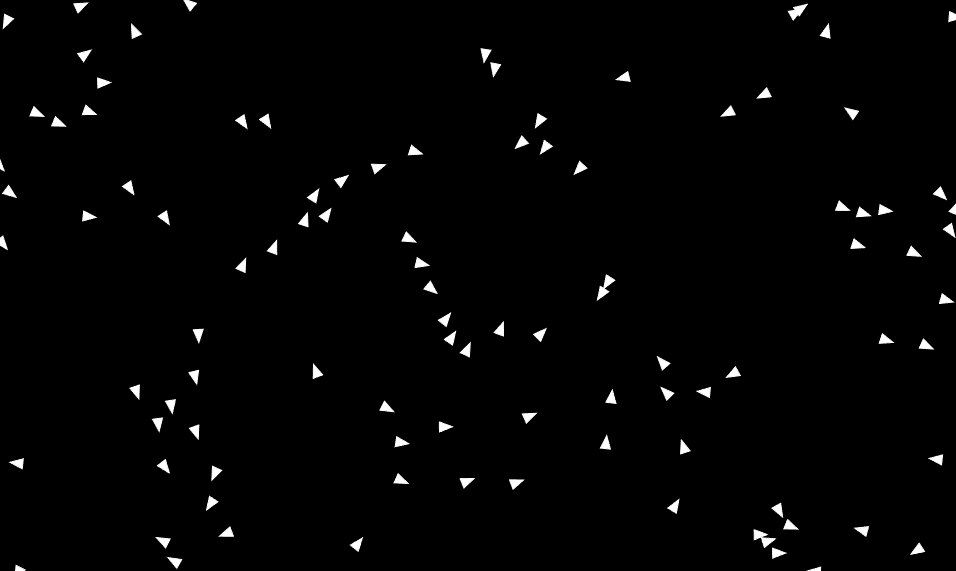

# Boids Simulation

This project simulates the flocking behavior of birds using an implementation of the [Boids algorithm](https://en.wikipedia.org/wiki/Boids).

See the simulationf or yourself [here](https://jwt2706.github.io/Boids)!

## Overview

The Boids algorithm models the behavior of an individual bird within a flock through three simple rules:

1. **Separation**: Avoid crowding neighbors (short range repulsion)
2. **Alignment**: Steer towards the average heading of neighbors
3. **Cohesion**: Steer towards the average position of neighbors (long range attraction)

Each boid in the simulation follows these rules, resulting in complex but really cool looking behaviors.

## Implementation

The simulation is implemented in JavaScript using the p5.js library for rendering. The main logic is contained in the `Boid` class, which represents an individual boid in the simulation. The `Boid` class has methods for calculating the separation, alignment, and cohesion forces, updating the boid's position and velocity, and rendering the boid.

The simulation is initialized and run in the `sim` function, which uses the p5.js `setup` and `draw` functions to create the boids and update the simulation each frame.

## Configuration

The number of boids in the simulation can be configured by changing the `NUMBER_OF_BOIDS` constant at the top of `boids.js`.

The behavior of the boids can be tweaked by adjusting the `maxForce` and `maxSpeed` properties of the `Boid` class, and the `perceptionRadius` variable in the `align`, `cohesion`, and `separation` methods. Although, the current values seemed to be the ones that work the best for me.
